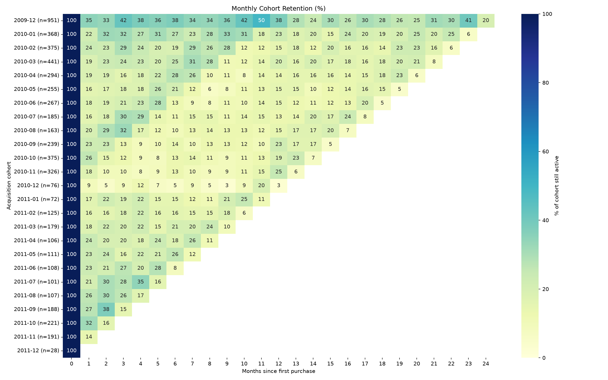
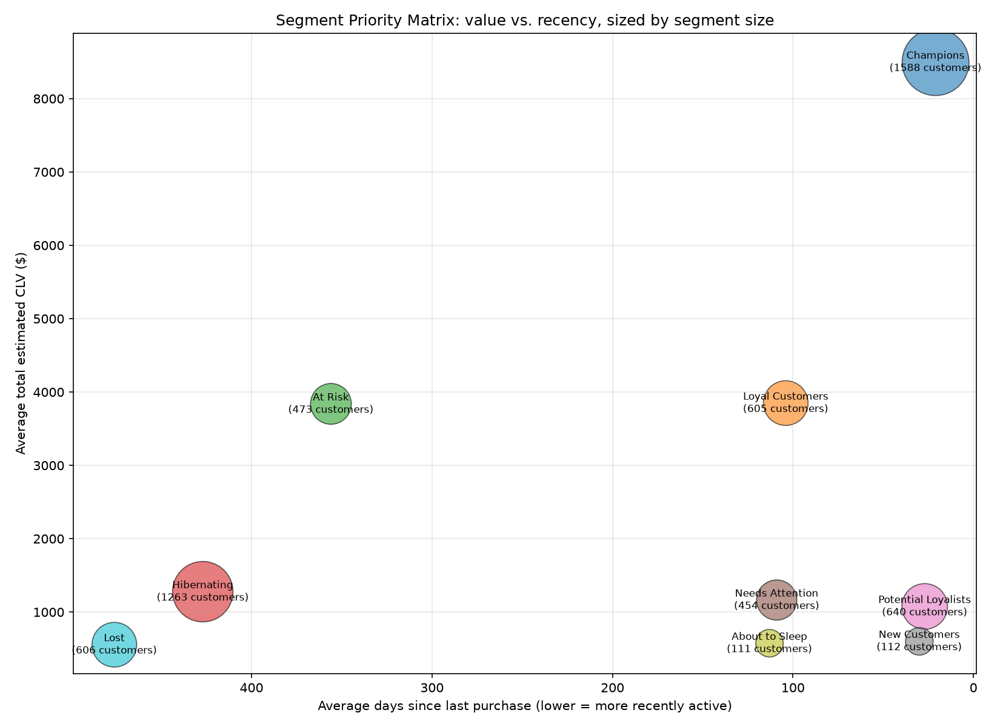

# Customer Analytics Suite: RFM Segmentation, Cohort Retention & CLV Modeling


An end-to-end customer analytics pipeline on 1M+ real invoice-line
transactions, answering the question a lifecycle marketing team actually has
to answer: **which customers are worth spending retention budget on, and
which aren't?**

The pipeline segments customers with RFM (Recency/Frequency/Monetary)
analysis, measures how retention actually decays over time with cohort
analysis, estimates customer lifetime value per segment, and ties all three
together into a concrete targeting recommendation.

## Why this dataset

[Online Retail II](https://archive.ics.uci.edu/dataset/502/online+retail+ii)
(UCI ML Repository) — ~1.07M invoice line items from a UK-based online
gift-ware retailer, Dec 2009–Dec 2011. It was chosen specifically because
it's real and unclean: ~25% of rows have no customer ID, cancellations are
stored as negative-quantity line items with no explicit flag, non-product
charges (postage, bank fees) are mixed in with real SKUs, and there are exact
duplicate rows from the source export. Every one of those problems had to be
found and handled explicitly — see [Key methodology decisions](#key-methodology-decisions).

> Chen, D. (2012). *Online Retail II* [Dataset]. UCI Machine Learning
> Repository. https://doi.org/10.24432/C5CG6D — CC BY 4.0.

## Tech stack

PostgreSQL for the heavy set-based transformations (RFM scoring via `NTILE`
window functions, cohort construction, CLV calculation) — chosen because
this kind of grouped, ordered aggregation is exactly what SQL is for, and
because building it as persistent staged tables makes every step of the
pipeline independently inspectable. Python (pandas, SQLAlchemy) moves small,
pre-aggregated results out of Postgres; matplotlib/seaborn renders the two
visualizations.

## Project structure

```
customer-analytics-suite/
├── README.md
├── requirements.txt
├── data/                         # place the downloaded dataset here (not committed)
├── sql/
│   ├── 01_create_schema.sql
│   ├── 02_clean_data.sql
│   ├── 03_rfm.sql
│   ├── 04_cohort_retention.sql
│   ├── 05_clv.sql
│   └── 06_segment_summary.sql
└── scripts/
    ├── 01_load_data.py
    ├── 04_cohort_heatmap.py
    └── 06_segment_matrix.py
```

## Pipeline

| Stage | Files | What it does |
|---|---|---|
| 1. Load | `01_create_schema.sql`, `01_load_data.py` | Load raw Excel data into `retail.raw_transactions` |
| 2. Clean | `02_clean_data.sql` | Build `retail.clean_lines` — drop unattributable/non-product/bad-price rows, dedupe, flag cancellations |
| 3. RFM | `03_rfm.sql`| Score every customer on Recency/Frequency/Monetary; assign one of 9 named segments |
| 4. Cohorts | `04_cohort_retention.sql`, `04_cohort_heatmap.py` | Build monthly acquisition cohorts and a month-by-month retention heatmap |
| 5. CLV | `05_clv.sql` | Historical + 12-month projected CLV per customer, using the retention curve as a survival function |
| 6. Synthesis | `06_segment_summary.sql`, `06_segment_matrix.py` | Join RFM + retention + CLV into one per-segment view and a priority-matrix chart |

Each stage's SQL depends on tables the previous stage created — run them in order.

## Quickstart

```bash
git clone <your-repo-url>
cd customer-analytics-suite
pip install -r requirements.txt

createdb customer_analytics
psql -U postgres -d customer_analytics -f sql/01_create_schema.sql

# Download online_retail_II.xlsx from
# https://archive.ics.uci.edu/dataset/502/online+retail+ii
# and save it as data/online_retail_II.xlsx

python scripts/01_load_data.py
psql -U postgres -d customer_analytics -f sql/02_clean_data.sql
psql -U postgres -d customer_analytics -f sql/03_rfm.sql
psql -U postgres -d customer_analytics -f sql/04_cohort_retention.sql
python scripts/04_cohort_heatmap.py
psql -U postgres -d customer_analytics -f sql/05_clv.sql
psql -U postgres -d customer_analytics -f sql/06_segment_summary.sql
python scripts/06_segment_matrix.py
```

## Key methodology decisions

- **Cancellations are kept, not dropped.** Returns carry negative quantity,
  so summing `quantity * price` per customer yields true net spend without
  needing to match refunds back to original orders. They're excluded from
  *frequency* counts (a return isn't a new order) but still count against
  *monetary* value.
- **Non-product stock codes are filtered via `stock_code ~ '^[0-9]'`** — real
  SKUs in this dataset are digit-led (e.g. `85123A`); postage, discounts,
  bank charges, and manual adjustments are not.
- **CLV uses one dataset-wide retention curve for every segment**, not
  per-segment curves. Per-segment curves looked appealing but are biased by
  cohort age — e.g. "New Customers" haven't existed long enough to show
  12-month retention, so their curve would just be missing data, not
  genuinely different. The segment-level differences in CLV instead come
  from real, unbiased differences in average order value and purchase
  cadence.
- Every stage writes a persistent table (`retail.*`), not a view, so results
  are inspectable and the pipeline is debuggable one stage at a time.

## Sample outputs

Generated by running the pipeline — add these images to the repo root (or
update the paths below) once you've run it against your own Postgres instance:




## Results

_Fill in after running the pipeline:_

- Segment sizes & revenue share — `sql/03b_segment_summary.sql`
- Average retention at months 1 / 3 / 6 — printed by `scripts/04_cohort_heatmap.py`
- Segment CLV ranking — `sql/05b_segment_clv_summary.sql`

## Recommendation: who should marketing target

| Segment | What it means | Action | Priority |
|---|---|---|---|
| Champions | Recent, frequent, high spend | VIP treatment, early access, referral asks | Retain & delight |
| Loyal Customers | Consistent buyers | Cross-sell / upsell, bundles | Grow value |
| Potential Loyalists | Recent, moderate value | Second-purchase incentives to build habit | Convert to loyal |
| New Customers | Just acquired | Onboarding sequence, welcome offer | Convert to loyal |
| Needs Attention | Slipping from average engagement | Personalized check-in, time-limited incentive | Re-engage |
| About to Sleep | Below-average engagement and value | Low-cost automated reactivation only | Light-touch monitor |
| At Risk | High historical value, gone quiet | Highest-priority win-back — proven spenders, worth a real incentive | Urgent win-back |
| Hibernating | Long dormant, moderate past value | Low-cost automated win-back sequence | Low-cost win-back |
| Lost | Long dormant, low value | Exclude from active spend | Deprioritize |

**The one-line version:** protect Champions and Loyal Customers, spend real
budget winning back At Risk customers (they've already proven they'll pay —
that's what makes them worth it), nurture New/Potential Loyalists toward
becoming Loyal, and stop spending on Lost.

## Skills demonstrated

- **Advanced SQL** — window functions (`NTILE`, `FILTER`, windowed
  aggregates), CTEs, cohort-based joins across staged tables
- **Data cleaning & validation** — handling missing keys, transaction
  reversals, and non-standard records in a real, undocumented dataset
- **Customer segmentation** — RFM framework, quintile scoring, mapping
  segments to concrete marketing actions
- **Retention / survival analysis** — cohort construction, retention curves,
  survival-based CLV projection
- **Data visualization** — seaborn heatmaps, matplotlib bubble charts
- **Analytics engineering** — a reproducible, documented, staged pipeline
  rather than a single monolithic notebook

## Possible extensions

- Probabilistic CLV via BG/NBD + Gamma-Gamma (`lifetimes` package) instead of
  the survival-curve heuristic used here
- A/B test the recommended actions against a holdout group per segment
- Re-run the same pipeline on the Olist Brazilian e-commerce dataset as a
  second case study (multi-table joins, and a real gotcha: `customer_unique_id`
  vs. per-order `customer_id`)
